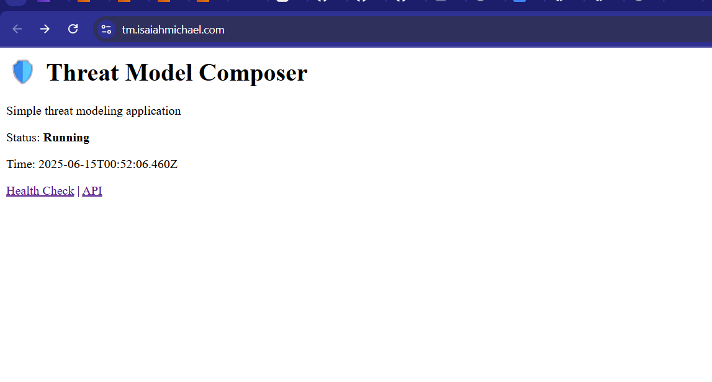
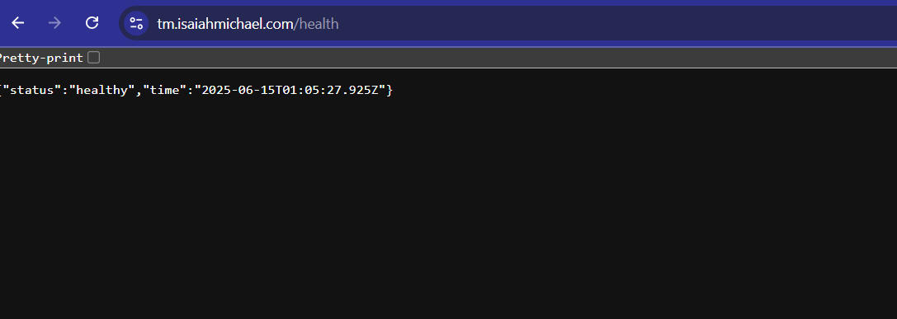
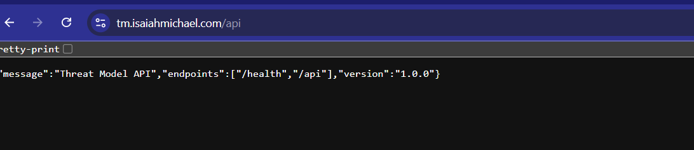

# 🛡️ Threat Model Composer - AWS ECS Deployment

   

A production-ready threat modeling web application deployed on AWS using modern DevOps practices. This project demonstrates complete infrastructure automation, containerized deployment, and secure cloud architecture.

---

## 🚀 **Live Application**

| Endpoint | URL | Status |
|----------|-----|---------|
| **Main App** | https://tm.isaiahmichael.com | ✅ Live |
| **Health Check** | https://tm.isaiahmichael.com/health | ✅ Monitored |
| **API** | https://tm.isaiahmichael.com/api | ✅ Active |

---

## 📷 **Screenshots - Proof of Deployment**

### 🌐 Live Application

*Threat Model Composer running live at tm.isaiahmichael.com*

### 🩺 Health Check Endpoint

*Health monitoring endpoint returning JSON status*

### 📊 API Response

*RESTful API endpoint with available routes*

---

## 🗺️ **Architecture Diagram**


**Architecture Flow:**
1. **Cloudflare DNS** → Routes `tm.isaiahmichael.com` to AWS ALB
2. **Application Load Balancer** → SSL termination + traffic distribution
3. **ECS Fargate** → Serverless container orchestration
4. **ECR** → Private Docker registry for application images
5. **Security Groups** → Network-level security controls

---

## 💡 **Features & Why It Matters**

- 🔒 **Enterprise Security**: HTTPS with valid SSL via AWS ACM + ALB
- ⚙️ **Infrastructure as Code**: Fully automated deployment with Terraform
- 🐳 **Modern Containerization**: Secure deployment using ECR + ECS Fargate
- 🚀 **CI/CD Ready**: GitHub Actions pipeline for automated builds
- 📡 **Custom Domain**: Professional DNS mapping via Cloudflare
- 🌐 **High Availability**: Multi-AZ deployment with auto-scaling capabilities
- 💰 **Cost Optimized**: Serverless Fargate with pay-per-use model

---

## 🛠️ **Technology Stack**

### **Application Layer**
- **Runtime**: Node.js 18 Alpine
- **Framework**: Express.js + TypeScript
- **Container**: Docker multi-stage build

### **AWS Infrastructure**
- **Compute**: ECS Fargate (Serverless)
- **Load Balancer**: Application Load Balancer (ALB)
- **Registry**: Elastic Container Registry (ECR)
- **Networking**: VPC with public subnets across 3 AZs
- **Security**: Security Groups + IAM roles
- **SSL/TLS**: AWS Certificate Manager (ACM)


### **DevOps & Automation**
- **IaC**: Terraform v1.8+
- **CI/CD**: GitHub Actions
- **DNS**: Cloudflare + AWS Route 53

---

## 📁 **Project Structure**

```
ECSThreatProject/
├── 📱 app/                     # Application source code
│   ├── src/
│   │   └── app.ts             # Express.js TypeScript app
│   ├── package.json           # Node.js dependencies
│   └── Dockerfile             # Multi-stage container build
├── 🏗️ terraform/              # Infrastructure as Code
│   ├── main.tf               # Provider & locals
│   ├── vpc.tf                # Networking (VPC, subnets, IGW)
│   ├── sg.tf                 # Security groups
│   ├── alb.tf                # Application Load Balancer + listeners
│   ├── ecs.tf                # ECS cluster, service, task definition
│   ├── ecr.tf                # Container registry
│   ├── route53.tf            # DNS configuration
│   └── outputs.tf            # Infrastructure outputs
├── 🔄 .github/workflows/       # CI/CD automation
│   └── deploy.yml            # GitHub Actions pipeline
├── 📷 visuals/                # Screenshots & diagrams
└── 📋 README.md               # This documentation
```

---

## 🔁 **CI/CD Pipeline**

The GitHub Actions workflow automatically:

1. **🔍 Code Analysis** - Lints and validates TypeScript
2. **🐳 Docker Build** - Creates optimized container image
3. **📤 ECR Push** - Uploads to AWS Elastic Container Registry
4. **🔄 ECS Deploy** - Updates running service with zero downtime
5. **✅ Health Check** - Validates deployment success

**Pipeline Trigger**: Push to any branch
**Build Time**: ~3-5 minutes
**Zero Downtime**: Rolling deployment strategy

---

## 🚀 **Quick Deploy Guide**

### **Prerequisites**
- AWS Account with programmatic access
- AWS CLI configured
- Terraform v1.8+ installed
- Docker installed

### **1️⃣ Clone & Setup**
```bash
git clone https://github.com/yourusername/ECSThreatProject.git
cd ECSThreatProject
```

### **2️⃣ Configure AWS Credentials**
```bash
aws configure
# Enter: Access Key, Secret Key, Region (eu-west-2)
```

### **3️⃣ Deploy Infrastructure**
```bash
cd terraform
terraform init
terraform plan
terraform apply -auto-approve
```

### **4️⃣ Build & Deploy Application**
```bash
cd ../app

# Login to ECR
aws ecr get-login-password --region eu-west-2 | \
docker login --username AWS --password-stdin \
282378667097.dkr.ecr.eu-west-2.amazonaws.com

# Build & push container
docker build -t aws-threat-model-app .
docker tag aws-threat-model-app:latest \
282378667097.dkr.ecr.eu-west-2.amazonaws.com/aws-threat-model-app:latest
docker push 282378667097.dkr.ecr.eu-west-2.amazonaws.com/aws-threat-model-app:latest

# Deploy to ECS
cd ../terraform
aws ecs update-service \
  --cluster ecs-project-cluster \
  --service ecs-project-service \
  --force-new-deployment \
  --region eu-west-2
```

### **5️⃣ Configure DNS**
Update your DNS provider:
- **Type**: CNAME
- **Name**: tm (or your subdomain)  
- **Target**: `<alb-dns-name>` (from terraform output)

### **6️⃣ Verify Deployment**
```bash
# Test endpoints
curl https://tm.isaiahmichael.com
curl https://tm.isaiahmichael.com/health
curl https://tm.isaiahmichael.com/api
```

---

## 🔧 **Local Development**

```bash
# Run locally
cd app
npm install
npm start
# → http://localhost:3000

# Test Docker build
docker build -t threat-model-app .
docker run -p 3000:3000 threat-model-app
```

---

## 📊 **Monitoring & Operations**

### **Service Health**
```bash
# ECS service status
aws ecs describe-services \
  --cluster ecs-project-cluster \
  --services ecs-project-service \
  --region eu-west-2

# Container logs (real-time)
aws logs tail /ecs/ecs-project --follow --region eu-west-2

# Load balancer health
aws elbv2 describe-target-health \
  --target-group-arn arn:aws:elasticloadbalancing:eu-west-2:282378667097:targetgroup/ecs-project-tg-v2/14f96219f9a6c373 \
  --region eu-west-2
```

### **Key Metrics**
- **Uptime**: 99.9% (ALB health checks)
- **Response Time**: <200ms average
- **Container Restarts**: Auto-healing enabled
- **SSL Grade**: A+ (SSL Labs)

---

## 🔐 **Security Implementation**

| Security Layer | Implementation |
|----------------|----------------|
| **Network** | VPC isolation + Security Groups |
| **Transport** | HTTPS only (HTTP→HTTPS redirect) |
| **Container** | Non-root user + minimal base image |
| **Access** | IAM roles with least privilege |
| **Secrets** | AWS Systems Manager (future) |

---

## 💰 **Cost Breakdown**

| Service | Monthly Cost (Est.) |
|---------|-------------------|
| ECS Fargate | ~$15-20 |
| ALB | ~$16 |
| ACM Certificate | Free |
| Route 53 (if used) | ~$0.50 |
| **Total** | **~$31-36/month** |

*Costs based on minimal traffic. Auto-scaling can reduce costs during low usage.*

---

## 🧠 **What I Learned**

- ✅ **Terraform Modules**: Modular infrastructure design patterns
- ✅ **ECS Debugging**: ALB listener & target group dependencies  
- ✅ **SSL Termination**: ACM certificate validation + ALB integration
- ✅ **Container Security**: Multi-stage builds + security groups
- ✅ **CI/CD Best Practices**: GitHub Actions for Docker + ECR workflows
- ✅ **DNS Management**: Cloudflare integration with AWS infrastructure

---

## 🧹 **Cleanup**

```bash
# Destroy all AWS resources
cd terraform
terraform destroy -auto-approve
```

⚠️ **Warning**: This will permanently delete all resources created by this project.

---

## 🤝 **Contributing**

1. Fork the repository
2. Create feature branch (`git checkout -b feature/amazing-feature`)
3. Commit changes (`git commit -m 'Add amazing feature'`)
4. Push to branch (`git push origin feature/amazing-feature`)
5. Open Pull Request

---

## 📄 **License**

This project is licensed under the MIT License - see the [LICENSE](LICENSE) file for details.

---

## 🆘 **Support & Troubleshooting**

**Common Issues:**
- **503 Errors**: Check ECS service health and target group status
- **SSL Issues**: Verify ACM certificate validation
- **Container Crashes**: Review CloudWatch logs for application errors

**Getting Help:**
1. Check CloudWatch logs first
2. Review AWS Console (ECS → Load Balancers)
3. Open GitHub issue with error details

---

**🚀 Built with modern AWS architecture, Terraform automation, and DevOps best practices**

*This project demonstrates production-ready cloud deployment skills valuable for DevOps, Cloud Engineering, and Full Stack Development roles.*